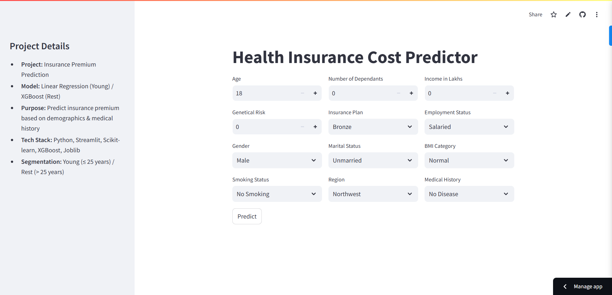
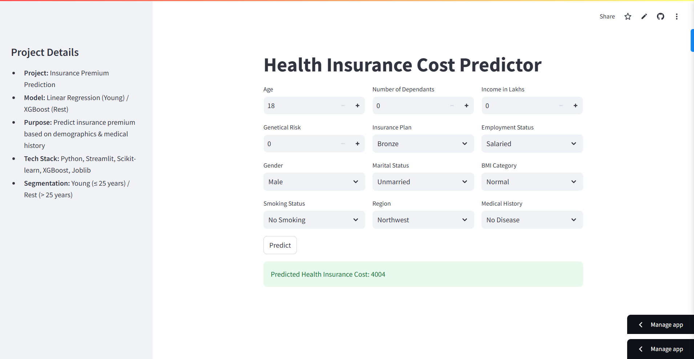

# Insurance Premium Prediction

An advanced insurance premium prediction model that uses machine learning techniques to accurately predict premiums based on user demographics, medical history, and other relevant features. This project employs segmented modeling to handle irregularities across different age groups for improved prediction accuracy.

Live Demo

Check out the deployed Insurance Premium Prediction Model here:https: //ml-project-insurance-premium-prediction-rudhresh.streamlit.app/

This Streamlit-based web application allows users to input their details and get real-time insurance premium predictions using machine learning models.
## Features

- **Segmented Modeling**: Separate models for `young` and `rest` age groups to address irregularities in specific age ranges.
- **Machine Learning Algorithm**: Built using `Linear Regression` for the `young` segment and `XGBRegressor` for the `rest` segment for robust and scalable regression.
- **Streamlit Frontend**: User-friendly interface to input data and get predictions in real-time.
- **Feature Engineering**: Includes risk normalization and feature scaling to optimize the model performance.

---
## Streamlit UI Preview
This project includes a **Streamlit-based web interface** for easy interaction.



---

## Installation

### Requirements

The following Python packages are required to run this project:

- `pandas==2.2.3`
- `numpy==2.2.2`
- `scikit-learn==1.4.2`
- `xgboost==2.1.3`
- `streamlit==1.22.0`
- `matplotlib==3.10.0`
- `seaborn==0.13.2`
- `joblib==1.3.2`

### Steps

1. Clone the repository:
   ```bash
   git clone https://github.com/rudra144/ml-project-insurance-premium-prediction.git
   ```
2. Navigate to the project directory:
   ```bash
   cd ml-project-insurance-premium-prediction
   ```
3. Install the required dependencies:
   ```bash
   pip install -r requirements.txt
   ```
4. Run the Streamlit application:
   ```bash
   streamlit run app/main.py
   ```

---

## Project Workflow

### 1. **Data Segmentation**

- Data was segmented into two groups:
  - `Young (Age ≤ 25)`
  - `Rest (Age > 25)`
- This segmentation addressed irregularities and improved the overall `R²` score.

### 2. **Feature Engineering**

- Features like `Medical History` were normalized using a risk scoring system.
- Numerical columns were scaled using `MinMaxScaler`.
- One-hot encoding was applied to categorical variables.

### 3. **Modeling**

- **Algorithm**: Linear Regression was chosen for the `young` segment, while XGBRegressor was used for the `rest` segment.
- **Training**: Separate models were trained for the `young` and `rest` groups.

### 4. **Streamlit Integration**

- A user-friendly frontend allows users to input data and get predictions.
- Input values are preprocessed and passed to the respective trained model.

---

## Files and Directories

- **`app/`**: Contains the Streamlit application files.
  - `main.py`: The frontend interface of the application.
  - `prediction_helper.py`: Handles preprocessing and predictions.
- **`artifacts/`**: Contains trained models and scalers:
  - `best_model_young_gr.joblib`
  - `best_model_rest_gr.joblib`
  - `scaler_young_gr.joblib`
  - `scaler_rest_gr.joblib`
- **Jupyter Notebooks**:
  - `data_segmentation.ipynb`: Notebook for data segmentation and preprocessing.
  - `ml_premium_prediction_young_with_gr.ipynb`: Training notebook for the `young` group.
  - `ml_premium_prediction_rest_with_gr.ipynb`: Training notebook for the `rest` group.

---

## How It Works

1. **User Input**:

   - Users input values like age, number of dependents, income, medical history, and other parameters through the Streamlit interface.

2. **Data Preprocessing**:

   - Inputs are transformed and scaled to match the format expected by the model.

3. **Prediction**:

   - Based on the user's age, the respective model (`young` or `rest`) is used to predict the insurance premium.

---

## Example Usage

1. Run the application:
   ```bash
   streamlit run app/main.py
   ```
2. Enter details like age, region, income, medical history, and other parameters.
3. Click on "Predict" to get the predicted insurance premium.

---

## Results

- Achieved high `R²` scores for both segments:
  - `Young`: 0.98
  - `Rest`:  0.99
- Improved prediction accuracy by addressing segmentation irregularities.

---

## Future Improvements

- Add support for additional features like credit score and claims history.
- Optimize the model for faster predictions.
- Explore deep learning models for even higher accuracy.

---

## License

This project is licensed under the MIT License.

---

## Contact

For any questions or collaboration opportunities, feel free to contact me:

- **Name**: Rudhresh Madhusudhanan
- **Email**: rudhresh.madhusudhanan\@stud.hs-emden-leer.de
- **GitHub**: [rudra144](https://github.com/rudra144)

